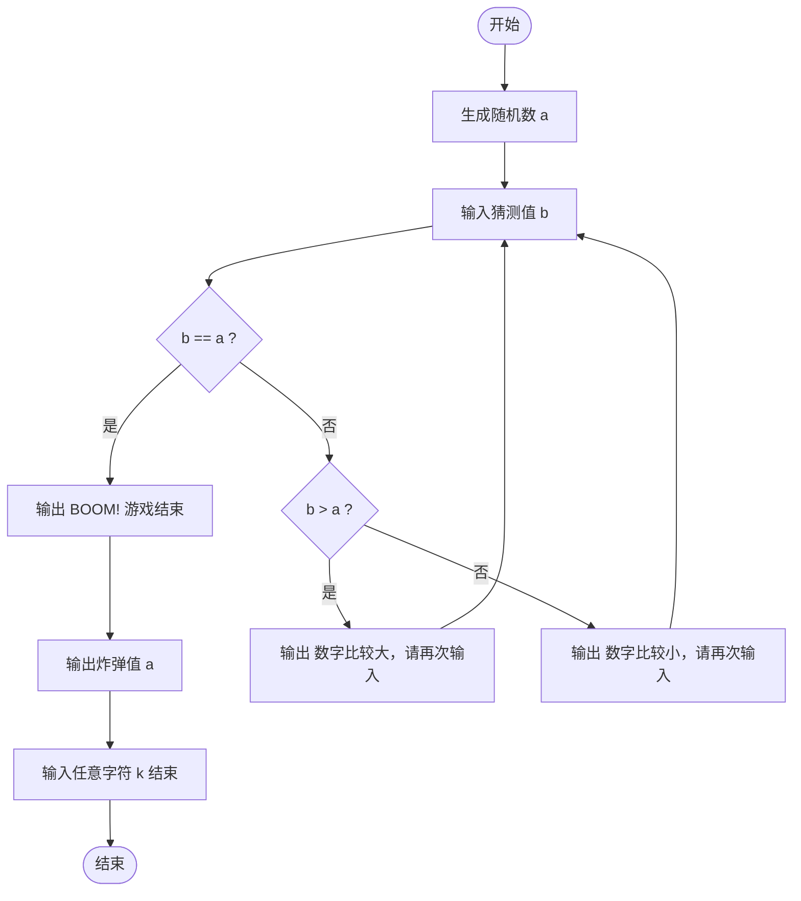

测试

<pre class="mermaid">

graph TD
    Start([开始]) --> A[生成随机数 a]
    A --> B[输入猜测值 b]
    B --> C{b == a ?}
    C -- 是 --> D[输出 "BOOM! 游戏结束"]
    D --> E[输出炸弹值 a]
    E --> F[输入任意字符 k 结束]
    F --> End([结束])
    C -- 否 --> G{b > a ?}
    G -- 是 --> H[输出 "数字比较大，请再次输入"]
    G -- 否 --> I[输出 "数字比较小，请再次输入"]
    H --> B
    I --> B

</pre>

<pre class="mermaid">

graph TD
    start([start]) --> A[生成一个随机数a]
    A --> B[输入值b]
    B --> C{b=a}
    C -- yes --> end([end])
    C -- no --> D{b>a}
    D -- yes --> E[大]
    D -- no --> F[小]
    E --> end
    F --> end

</pre>

<pre class="mermaid">

graph TD
    Start([开始]) --> A[生成随机数 a]
    A --> B[输入猜测值 b]
    B --> C{"b == a ?"}
    C -- 是 --> D[输出 BOOM! 游戏结束]
    D --> E[输出炸弹值 a]
    E --> F[输入任意字符 k 结束]
    F --> End([结束])
    C -- 否 --> G{"b > a ?"}
    G -- 是 --> H[输出 数字比较大，请再次输入]
    G -- 否 --> I[输出 数字比较小，请再次输入]
    H --> B
    I --> B

</pre>

# 猜数字游戏流程图

以下是用 Mermaid 绘制的 C 代码逻辑流程图，展示了随机数生成、用户输入、循环比较和结果输出的完整过程。

其他内容
